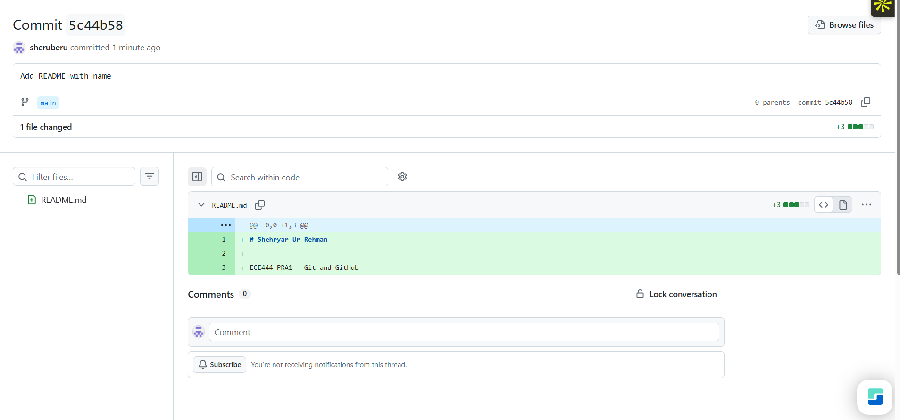
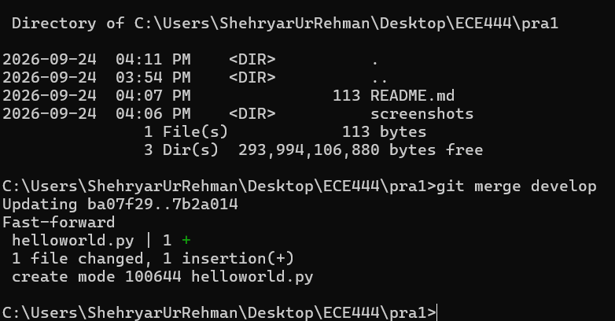
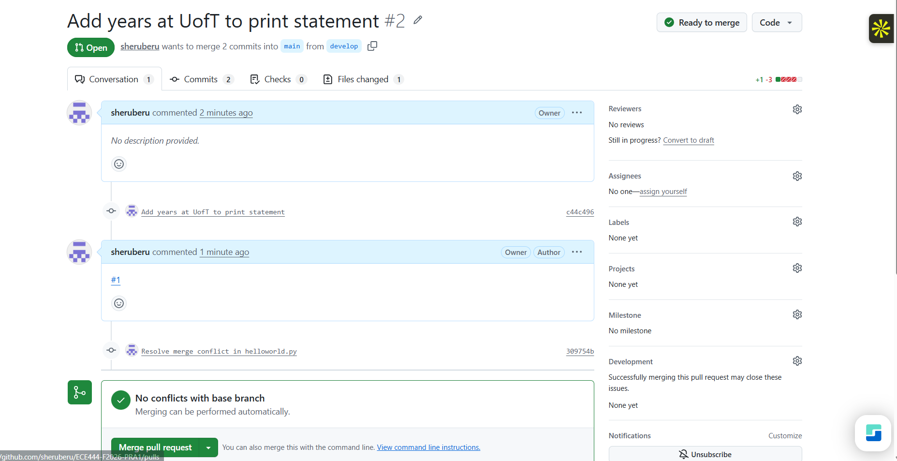
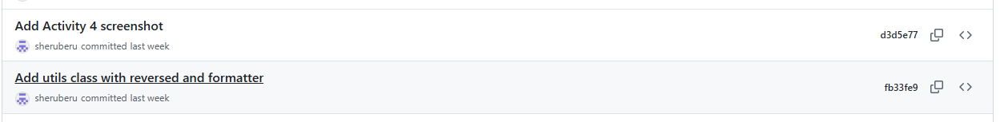
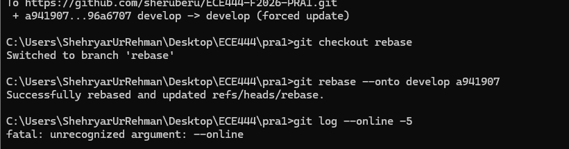
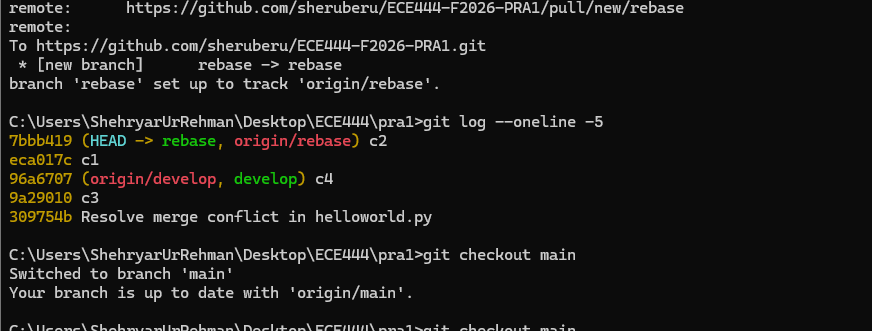

# Shehryar Ur Rehman

ECE444 PRA1 - Git and GitHub

## Activity 1

## Activity 2

## Activity 3

## Activity 4

## Activity 5

Running the rebase:

After the rebase - order is c3, c4, c1, c2:

